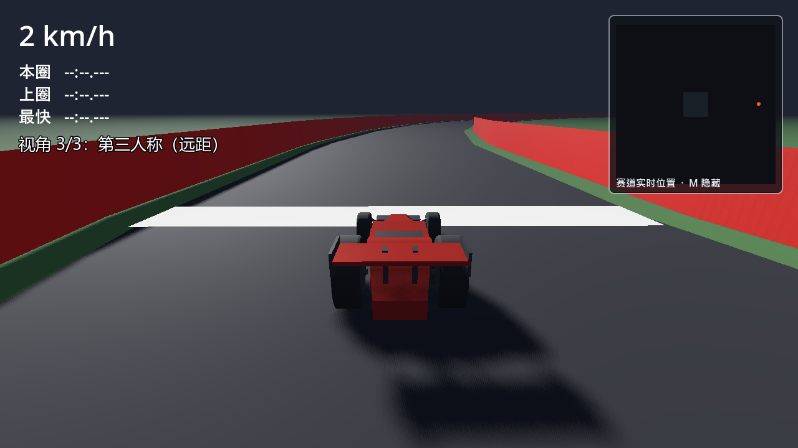

# Godot Racer

用 **Godot 4** 做的 3D 赛车游戏：5 个数据驱动关卡、会避让的 AI 对手、会真实改变抓地力的天气、
静态与滑动障碍，附带一套可自动化的验收测试。



## 特性

- **5 个关卡**，难度递进（新兵训练营 → 阳光竞速场 → 雨夜街道 → 荒漠遗迹 → 极地挑战）。
  加关卡只需新增一个 `.tres`，不用复制场景。
- **AI 对手**：每关 1 台，与你**并排发车**（你起步它才起步），会主动绕开你，也会避让障碍。
  可在主菜单里关掉。
- **天气**：晴 / 雨 / 雪 / 沙尘。不只是换颜色——抓地力倍率真实生效（0.5~1.0）。
- **障碍**：静态障碍（合并为单个物理节点）+ 横向滑动路障，任何时刻都留得出一条通道。
- **小地图**：赛道轮廓 + 检查点 + 你 + 对手 + 障碍，四类标记用颜色和形状区分。
- **暂停菜单**：`ESC` → 继续 / 重新开始 / 返回选关 / 退出。

## 环境要求

| 需要 | 说明 |
|---|---|
| **Godot 4.4.1**（Windows） | 已用 `4.4.1-stable` 验证。默认期望装在 `E:\godot\` |
| Python 3.10+ | **可选**，只在重新生成测试用例时需要 |
| OpenRouter API key | **可选**，只在联网生成测试用例时需要。**玩游戏不需要** |

## 快速开始

1. 安装 Godot 4.4.1，解压到 `E:\godot\`
   （或改 `04-Godot启动器/launcher-menu.ps1` 里的 `$Godot` 和 `运行游戏.bat` 里的路径）
2. 双击 **`04-Godot启动器/启动器.bat`** → 选 `1) 运行游戏`

启动器菜单里还能跑验收测试、生成测试用例、看日志、做启动诊断。

> 也可以直接命令行：
> `Godot_v4.4.1-stable_win64.exe --path godot-racer`
>
> 用 `*_console.exe` 会在这台机器上启动期段错误，用不带 `console` 的那个。

## 操作

| 键 | 作用 |
|---|---|
| `W` / `S` | 油门 / 刹车·倒车 |
| `A` / `D` | 左 / 右转向 |
| `空格` | 手刹 |
| `R` | 复位（离赛道中心 < 3 m 时只扶正车身） |
| `V` | 切换视角（第一 / 第二 / 第三人称） |
| `M` | 显示 / 隐藏小地图 |
| `ESC` | 暂停菜单 |
| 右键拖动 | 环视 |

极速（80~240 km/h）和 AI 对手开关都在**主菜单**里调。

## 配置（可选）

只有在使用 AI 测试功能时才需要配置，玩游戏完全不需要。

1. 复制 `godot-racer/openrouter.cfg.example` 为 `godot-racer/openrouter.local.cfg`
2. 填入你的 key 和代理端口：

```ini
api_key=sk-or-v1-...
proxy=http://127.0.0.1:7892
```

也可以用环境变量：`OPENROUTER_API_KEY` / `OPENROUTER_PROXY` / `OPENROUTER_TIMEOUT`。

`openrouter.local.cfg` **已在 `.gitignore` 里**，不会被提交。没有 key 时压测会自动降级为
本地确定性测试，不会报错也不会卡住。

验证连通性：

```powershell
cd 04-Godot启动器
pwsh -File .\test-openrouter.ps1        # 独立探针，不依赖 Godot
pwsh -File .\run-check.ps1 -Check models   # 顺便查当前真实可用的免费模型
```

## 目录结构

```
godot-racer/               Godot 工程
├── scenes/                场景（menu / main / track / race_car）
├── scripts/               游戏逻辑（vehicle / ai_opponent / track_generator / track_layout / hud ...）
├── data/levels/           关卡配置（*.tres）+ 落盘的测试用例
├── assets/textures/       AI 生成的地面与路面贴图
├── models/                赛车模型（来自 02-Blender建模）
├── tools/                 开发期工具（测试用例生成器、截图诊断、赛道布局闭环解算）
└── docs/                  详细文档（见下）

04-Godot启动器/            双击即用的入口：游玩 / 验收 / 生成用例 / 诊断
screenshots/              画面记录
```

> 赛道形状由 **路段 DSL** 描述（`scripts/track_layout.gd`：`straight/arc/sweeper/hairpin/chicane`）。
> 拼装**不保证首尾相接**，所以设计新赛道要先跑 `tools/layout_closure.py` 把长度解出来
> —— 手写长度几乎不可能闭合（实测有一版残差 340m）。

## 文档

| 文档 | 内容 |
|---|---|
| [godot-racer/docs/testing.md](godot-racer/docs/testing.md) | 验收检查怎么跑、每项的验收标准、最近一次结果 |
| [godot-racer/docs/engineering-notes.md](godot-racer/docs/engineering-notes.md) | **改代码前必读**：踩过的坑与验证方法 |
| [godot-racer/docs/ai-opponent-design.md](godot-racer/docs/ai-opponent-design.md) | AI 对手设计：并排距离的推导、车道、发车时机 |
| [godot-racer/AGENTS.md](godot-racer/AGENTS.md) | 本项目的开发契约（安全红线、工程规范、目录约定） |
| [godot-racer/docs/plans/tracks-and-elevation.md](godot-racer/docs/plans/tracks-and-elevation.md) | **赛道重设计总体计划**（路段 DSL / 起伏 / 地形带 / 五关设计 / 验收标准）与当前进度 |

## 测试

```powershell
cd 04-Godot启动器
pwsh -File .\run-all-checks.ps1            # 全部 16 项，最后汇总成一张表
pwsh -File .\run-all-checks.ps1 -Quick     # 只跑快的
pwsh -File .\run-check.ps1 -Check avoid -Level 4   # 单项
```

细节与验收标准见 [docs/testing.md](godot-racer/docs/testing.md)。

> 这台机器上 Godot 4.4.1 **启动期**偶发 signal 11（空场景也会，与项目无关），
> 所以脚本都内置重试。手动跑命令时失败一次请重试。

## 已知限制

- AI 只做巡线与避让，不会主动超车或走最优线。
- 障碍是固定布局（按关卡配置 + 固定种子生成），没有随机化。
- 只有引擎占位音，没有音效与背景音乐。
